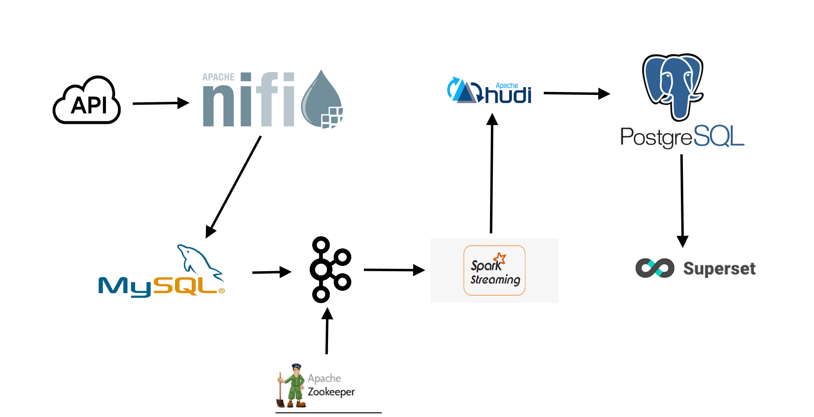
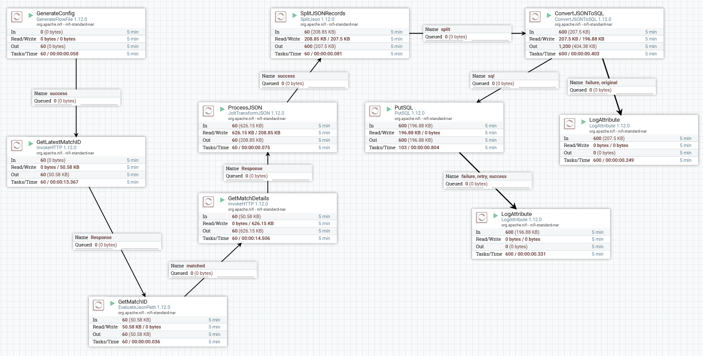
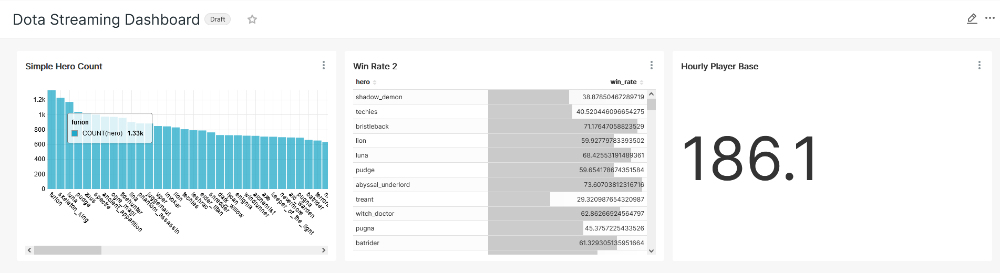

# Dota_Streaming
Project to demonstrate an end-to-end streaming pipeline for data engineering purposes.  I aim to stream data from the Dota API using NiFi, feed the data to a Change Data Capture (CDC) database, perform data transformations via Spark Streaming and then write to a table to be utilized by a front end dashboard.

### Dota 2 API calls

Data can be obtained from the Dota 2 API using HTTP requests.  In this case, I use 2 HTTP requests; the first is to pull the latest match id from the API and the second is to use the match id to pull the full match details.  I also do 2 one-off requests to pull the hero and item data.

The API will return a JSON object of the data in both cases (data examples can be found under the data folder).

### NiFi

I use NiFi to ingest data from the Dota API and direct it to our CDC database (a mysql database in this case).  Note that NiFi is set to pull data once every 2 seconds here.  This is because Steam limits API calls to 100,000 a day and since I need to make 2 calls to the API, I can't call at a higher rate.

Additionally, I use a JOLT JSON Transformer in order to hammer the JSON object into something that fits the database better.  This includes removing data that I'm not interested in and transforming the single JSON into an array of 10 entries, each corresponding to a different player from the match.  This allows me to use the Split JSON processor to split the JSON into 10 entries before it hits the Convert JSON to SQL and Put SQL processors.

The latter 2 processors will convert the JSON to an INSERT SQL query and put all 10 entries into the CDC.

### Change Data Capture (CDC) --MySQL

The CDC contains all the raw data ingested and transformed by NiFi.  From here, Debezium is used to link the database to a Kafka cluster that ingests the data as a stream.  

Some specifics:
1. Database: dota
2. Table: match_data

### Spark Streaming

The spark job is set up to handle the streaming data from kafka and do a few simple transformations and then output to Hudi and Postgresql.  

### Superset

I use Superset to make a simple dashboard to analyze the data as it comes in.

